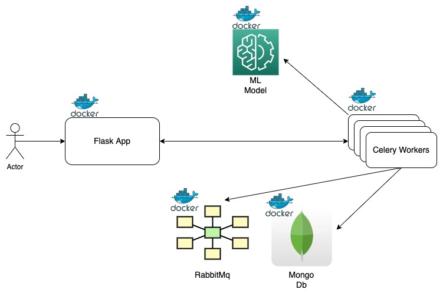

# LSML Final Project
## Question Answering Application
The project has question answering application. You can input a context 
and can then ask a question related to that context.

Request
```json
{
    "question": "how is assignment graded?",
    "context": "This programming assignment is graded based on completion of the tasks from the notebook. Click \"Work in Browser\" and complete the tasks by following the instructions described therein. To submit the assignment, click \"Submit assignment\" in the upper right corner of your notebook. Click \"My submission\" to see the results."
}
```

Response
```json
{"status": "DONE",
  "answer": "based on completion of the tasks from the notebook"}
```

The service uses pretrained question-answering model called `deepset/roberta-base-squad2`.

### Service Components
- **ML Model** - The `ml_model` module has `QAModel` class that acts as a wrapper
over the pretrained model. This model is lazily loaded when the first call
is made.
- **Celery Worker** - Since fetching response from model can take several 
seconds, it is better to do it in an async fashion. The benefit is that
we don't have to keep http connection open for long durations and response
can be returned to the user when it is ready. The drawback is that the 
users cannot expect sub-millisecond latency so it can't be a realtime
application. There is only 1 celery task located at 
`celery_worker/celery_task_app/tasks.py`. Celery by default creates 4 
workers to execute tasks. So the ml model is loaded on all the workers.
- **Flask App** - The flask_app has api endpoints to make async calls to
the model. There are 3 endpoints:
    ```
    1. GET (/) - Health Check Endpoint
    2. POST (/get_answer) - Send qa(question-answering) request to the model
    3. POST (/get_answer/<task_id>) - Poll for response for a given task
    ```
### Architecture
The architecture diagram below shows how different components are 
interacting with each other.


### Launch and Usage Instructions
- You should have `docker` installed in your system.
- With LSMLFinal as you working directory, run the following
docker command.
    ```
     docker-compose up --build
    ```
- Wait for all containers to start. You can check if the service is up
by hitting the default `health-check` endpoint.
    ```
        curl --location --request GET 'localhost:8081'
   ```
- Now you can send request to `/get_answer` endpoint
    ```
    Request
    
    curl --location --request POST 'localhost:8081/get_answer' \
    --header 'Content-Type: application/json' \
    --data-raw '{
    "question": "how is assignment graded?",
    "context": "This programming assignment is graded based on completion of the tasks from the notebook. Click \"Work in Browser\" and complete the tasks by following the instructions described therein. To submit the assignment, click \"Submit assignment\" in the upper right corner of your notebook. Click \"My submission\" to see the results."
    }'
  
    Response
    
    {"task_id": "qwer-dsada-dsdsds-ertet"}
    ```
- This api returns a task_id as output. Now poll the service
using this task_id to fetch the actual response.
- Below is the curl for status api `/get_answer/<task_id>`
    ```
    curl --location --request GET 'localhost:8081/get_answer/869fece2-6296-4776-bfb6-e272047b57e4'
    ```
- Response if output is not ready:
  ```
    {"status": "INPROGRESS"}
  ```
- Response if output is ready:
    ```
    {"status": "DONE",
  "answer": "based on completion of the tasks 
     from the notebook"}
    ```
- **Note** - The response of first request might be slow since the
model is lazily loaded on the first request.